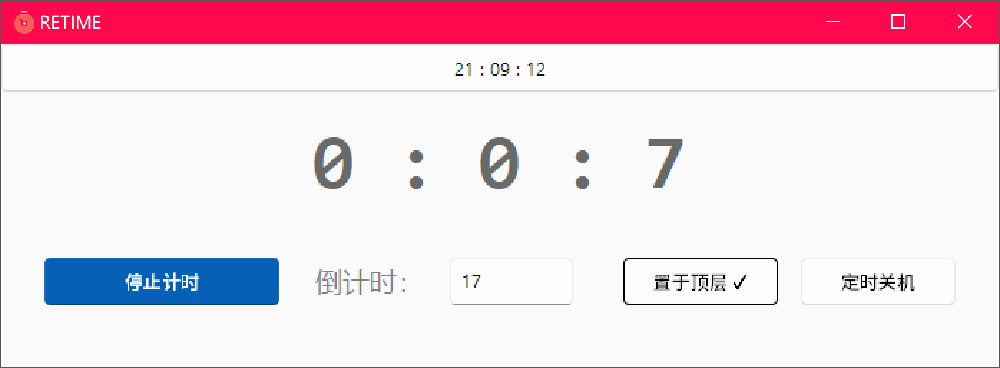
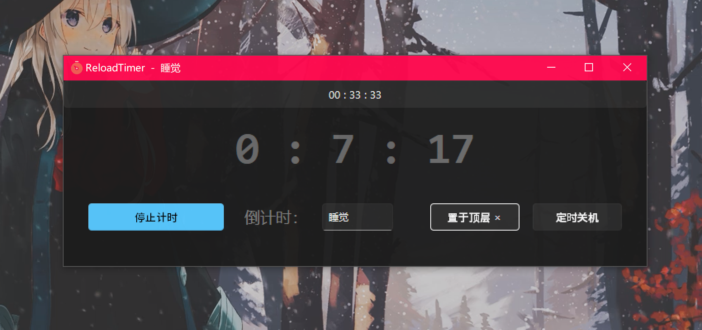

# RETIME.tkinter
一个使用Python Tkinter开发的简单倒计时GUI软件

说真的，用tkinter来做这种软件真的很痛苦
为了避免tkinter的丑逼界面，我使用了一个挺牛逼的控件库：https://github.com/rdbende/Sun-Valley-ttk-theme :)

A Easy App to Countdown
It was developed with tkinter

Seriously, tkinter to do this kind of software is really painful
To avoid tkinter's ugly interface, I used a nice library of controls: https://github.com/rdbende/Sun-Valley-ttk-theme :)

2022.10.01
